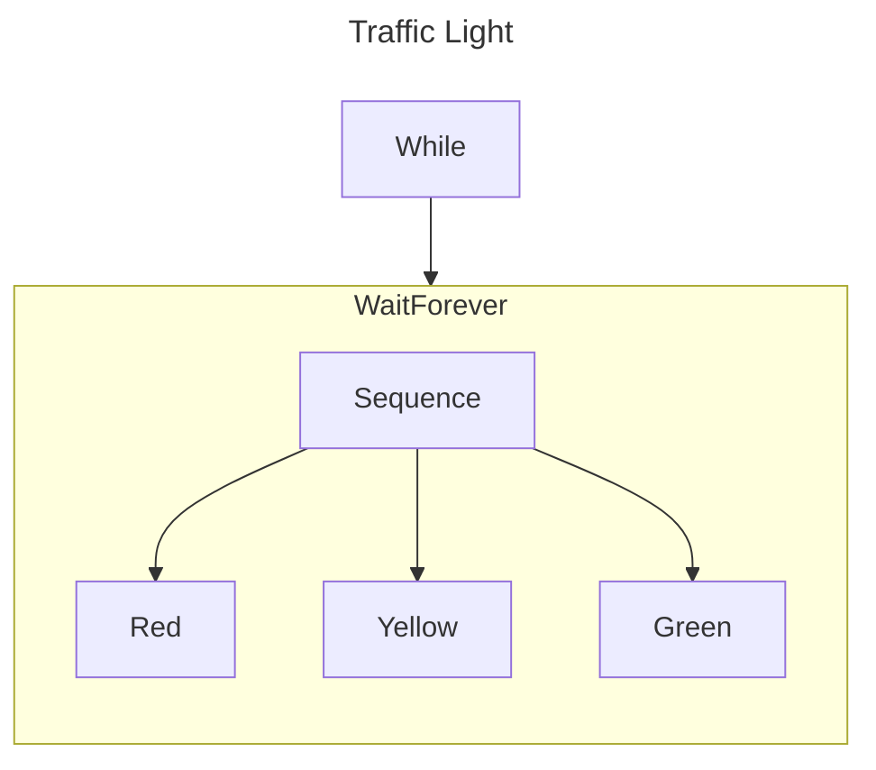

# BehaviorTree

# TODO

- [ ] Heap profiling
- [ ] Unit tests with branch coverage
- [ ] Visualization using Graphviz
- [ ] Dynamnic visualization (see Groot2)

# Example

## Traffic Light

```mermaid
---
title: Traffic Light
---
graph TB
    While --> WaitForever
    subgraph WaitForever
        direction TB
        Sequence --> Red
        Sequence --> Yellow
        Sequence --> Green
    end
```
