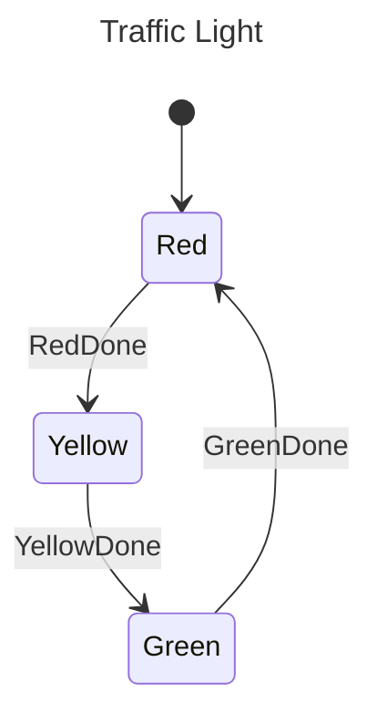

# StateMachine

Goal: Modelling a UML StateDiagram to a StateMachine in rust

# Definition

- [x] Can move from one state to the next state
- [x] Can move from one state to the end state (termination) (optional)
- [x] Define transition constraints from one State to another State
  - [x] At Run time
  - [ ] At Compile time

# Implementations

## StateMachine

- `StateTransition` trait
- `StateMachine` implementation to run StateTransitions
- `src/stm.rs`

## AsyncStateMachine

- `AsyncStateTransition` trait
  - depends on `async-trait` crate
- `AsyncStateMachine` implementation to run Async StateTransitions
- `src/async_stm.rs`

# Examples

## Traffic Light

- `examples/traffic_light.rs` -> StateMachine
- `examples/async_traffic_light.rs` -> AsyncStateMachine

